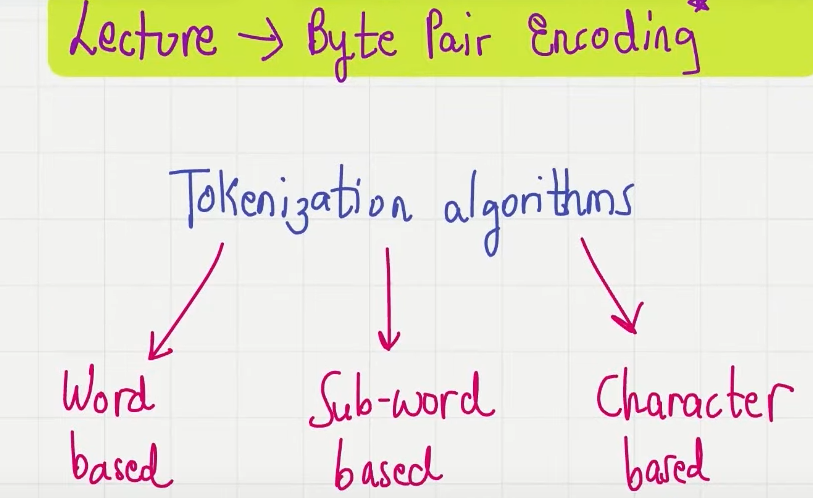
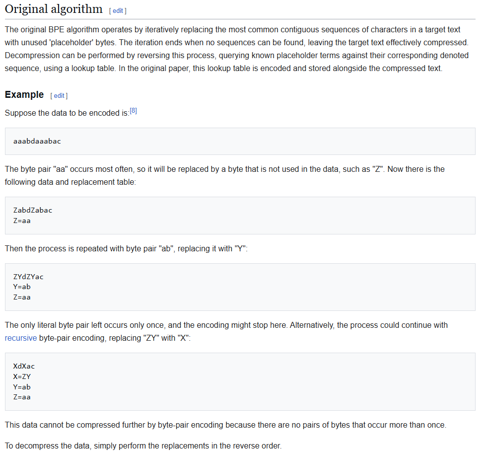
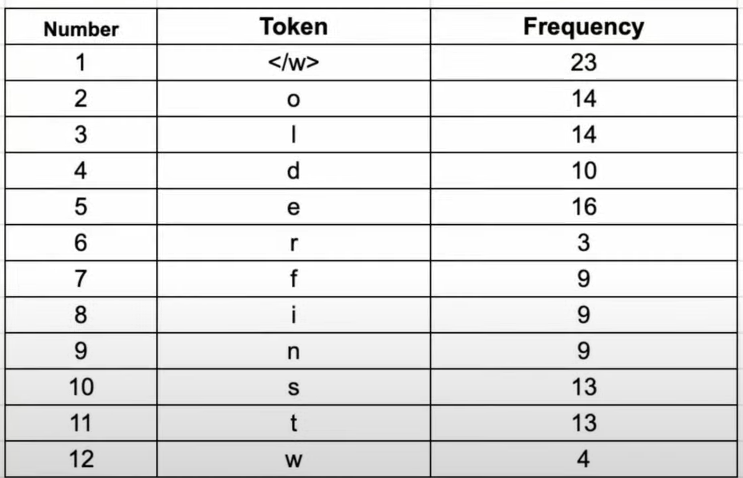
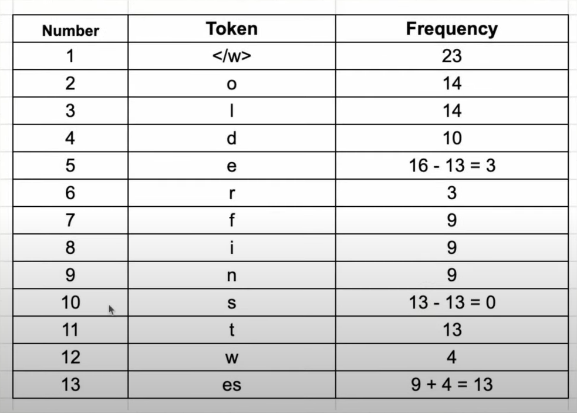
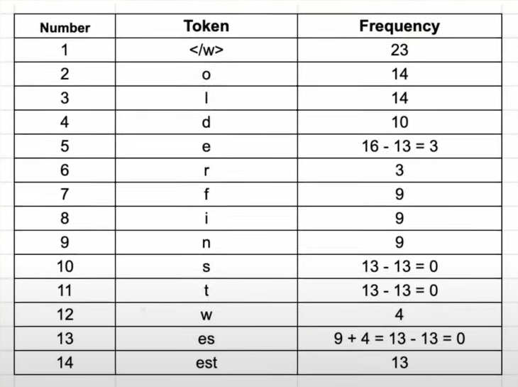
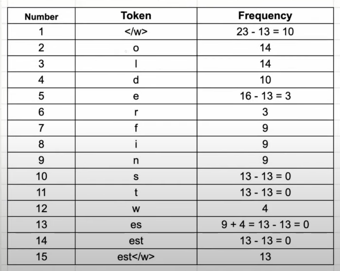
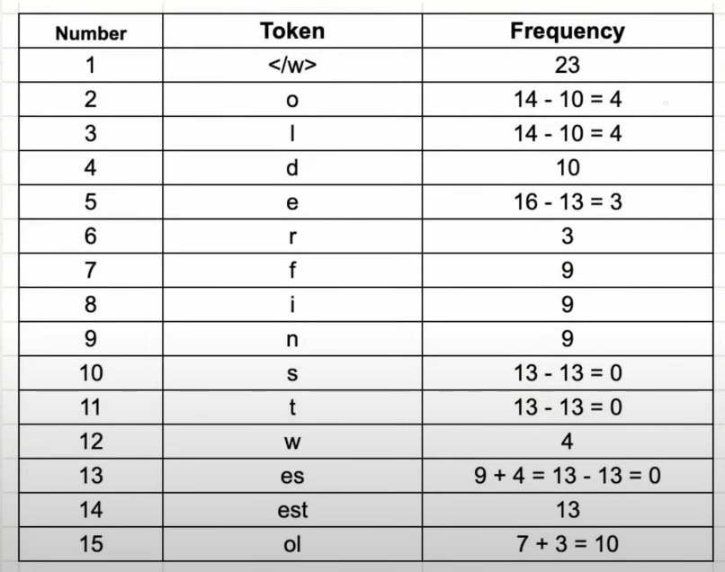
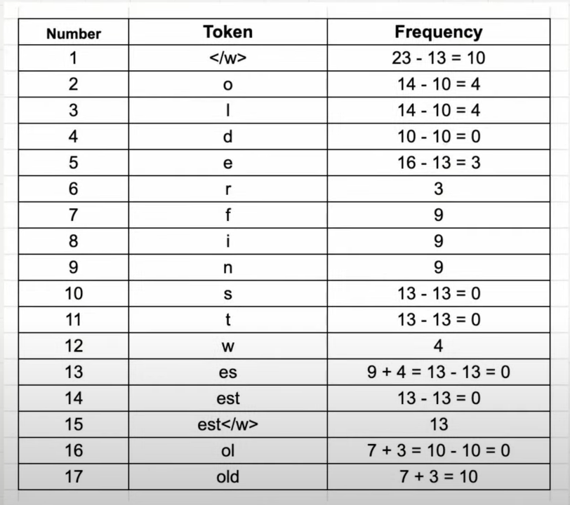
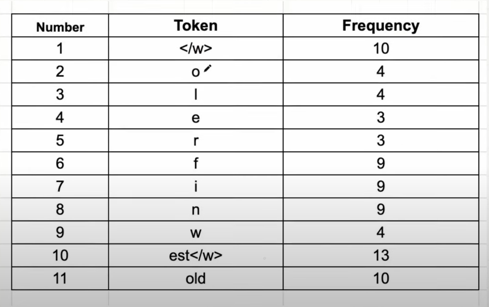
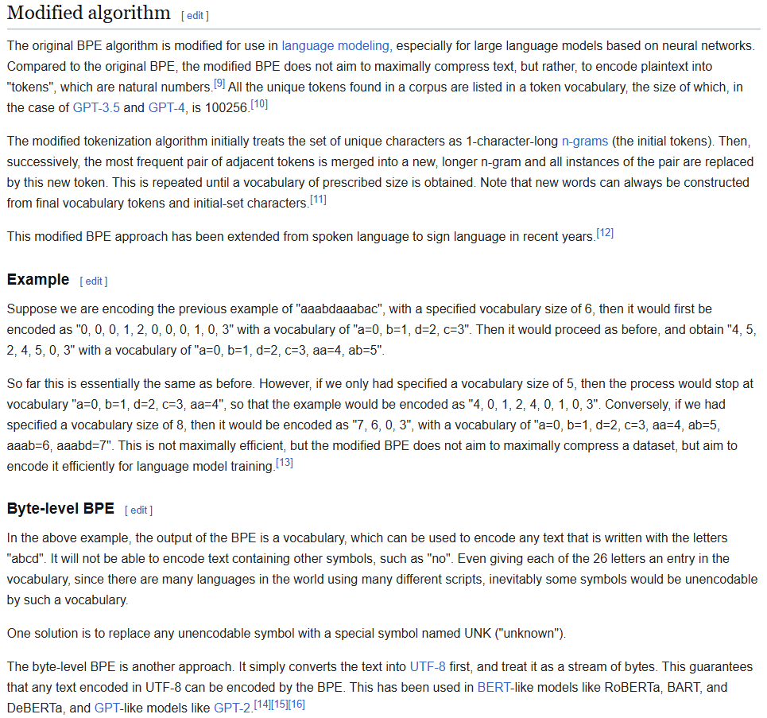

# **Byte Pair Encoding**

- there are 3 types of `tokenization algorithm` they are `word based`, `sub-word based` and `character based`

- **Word based tokenizers**:

  - every word in the text/sentence is considered a token
  - eg: `My hobby is playing cricket` -> `['My', 'hobby', 'is', 'playing', 'cricket']`
  - **Problem**: what do we do with the `Out of Vocabulary(OOV)` words, different meaning of similar words `[boy, boys]`

- **Character based tokenizers**:

  - every character in the text/sentence is considered a token
  - eg: `My hobby is playing cricket` -> `['M', 'y', 'h', 'o', 'o',...]`
  - this leads to very small vocabulary, which solves the `OOV` problem. Every language has a fixed number of characters (english ~ 256)
  - **Problem**: `(1).`the meaning associated with the words is completely lost. Also, `(2).`the tokenized sequence is much longer thatn the initial raw text.

- **Sub-word based tokenizers:**

  - this is mix between `word` and `character` `based tokenizers`
  - **Rules of sub-word based tokenization**:

    - **Rule 1**: `Do not split` frequently used words in `smaller subwords`.
    - **Rule 2**: Split the `rare` words into `smaller`, `meaningful` `subwords`
    - eg1: `boy` should not be split
    - eg2: `boys` should be split into `boy` and `s`

  - the subword splitting helps the model learn that different words with the same root words such as `token` like `tokens` and `tokenizing` are similar in meaning
  - it also helps the model to learn that say `tokenization` and `modernization` are made up of different root words but have the same suffix `ization` and are used in same syntatic situation

## BYTE PAIR ENCODING (BPE)

- this is a subword tokenization algorithms
- this is a data compression algorithm
- **BPE algorithm(1994)**: most common pair of `consecutive byte` of data `is replaced with a byte` that does not occur in data

- An example from wikipedia
  

### **How is the BPE algorithm used for LLMs?**

- `BPE` ensures that mose common words in the vocabulary is represented as a single token, while rare words are broken down into two or more subwords tokens.
- example: let consider a dataset or words:

  `{"old":7, "older":3, "finest":9, "lowest":4}`

- Preprocessing: we need to add the end token `</w>` at the end of each word.

  `{"old</w>":7, "older</w>":3, "finest</w>":9, "lowest</w>":4}`

- we now split words into charcters and count their frequency:
  

- next step in BPE algorithm is to look for the most frequent pairing then _merge them and perform the same iteration again and again until we reach the token limit or iteration limit_

- **Iteration 1:** start with second most common token in this case `e`. Most common byte pair start with `e` is `es`.
  

- **Iteration 2:** merge the tokens `es` and `t` as they have appeared 13 times in our dataset
  

- **Iteration 3:** Now let look at the `</w>` token. we see that`est</w>` has appeared 13 times.

  - so we get this `est</w>` because in our actual dataset from ` "finest</w>":9, "lowest</w>":4` you realise that after `est`, the end of word token `</w>` is also seen here which makes it a byte pair. and hence has to be converted into one token.
  - this helps the algorithm understand the differece between certain words like `estimate` and `highest`. so `est</w>` token here will make the model understand that, this token can be used at the end of certain words because of the end of word token `</w>` as opposed to being used in the middle of starting or a word
    

- **Iteration 4:** we also find `o` and `l` appearing 10 times from our dataset `"old</w>":7, "older</w>":3`
  

- **Iteration 5:** we also find `ol` and `d` appearing 10 times from our dataset `"old</w>":7, "older</w>":3`
  

- `f`, `i`, `n` appear 9 times. But we just have one word that these characters exist in out dataset so that is fine

- let now remove tokens with zero count
  

- this list of 11 tokens will serve as our vocabulary.
- the stopping criteria can either be the `token count` or the `number of iterations`.

**more on tokenization, source: wikipedia**

