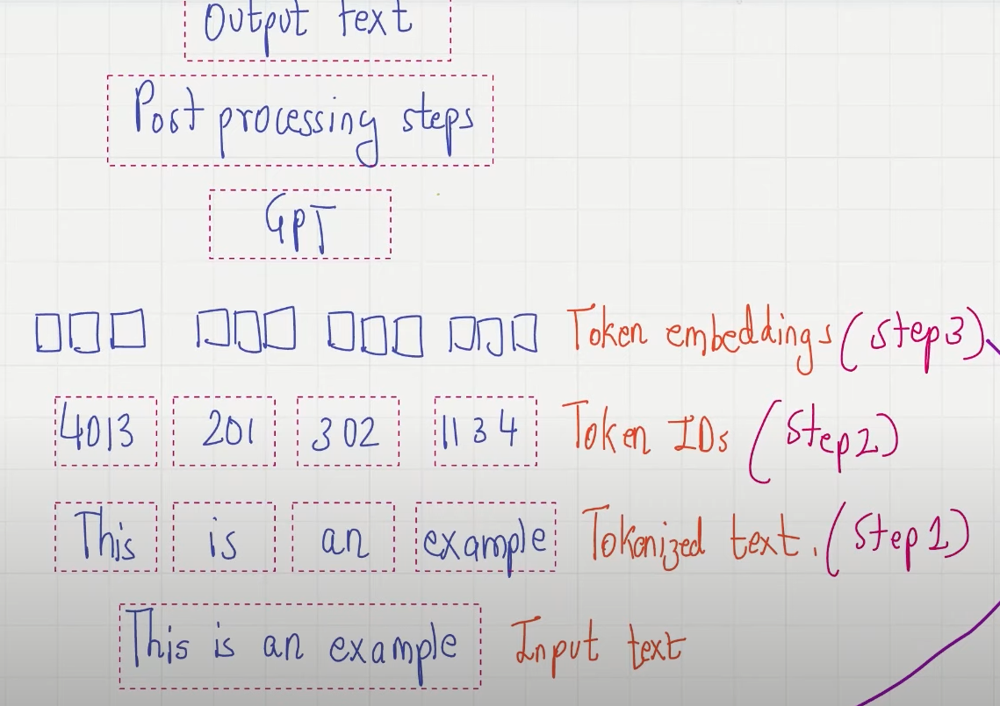
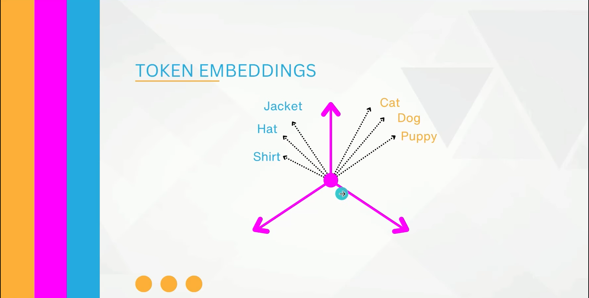
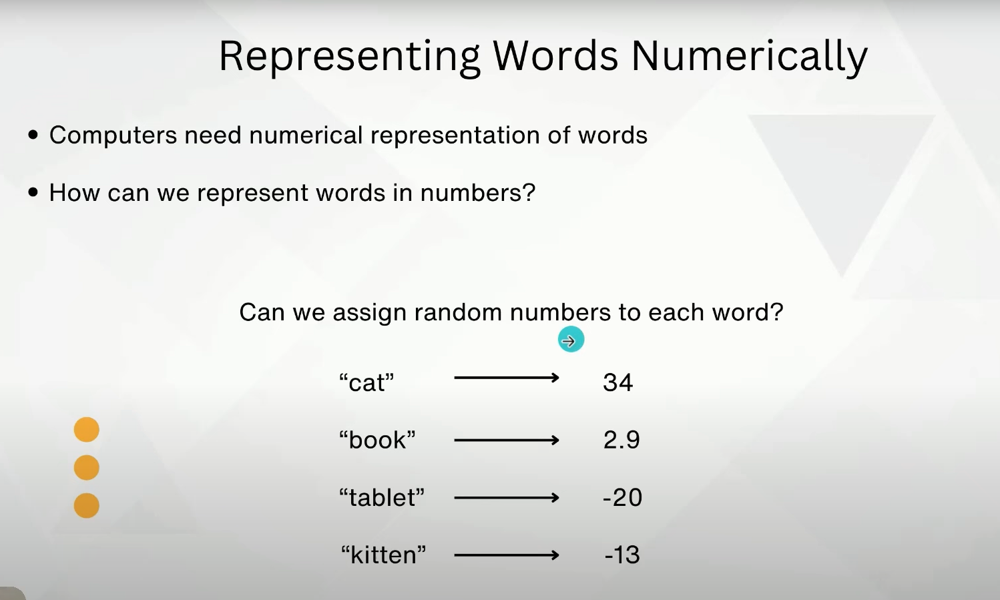
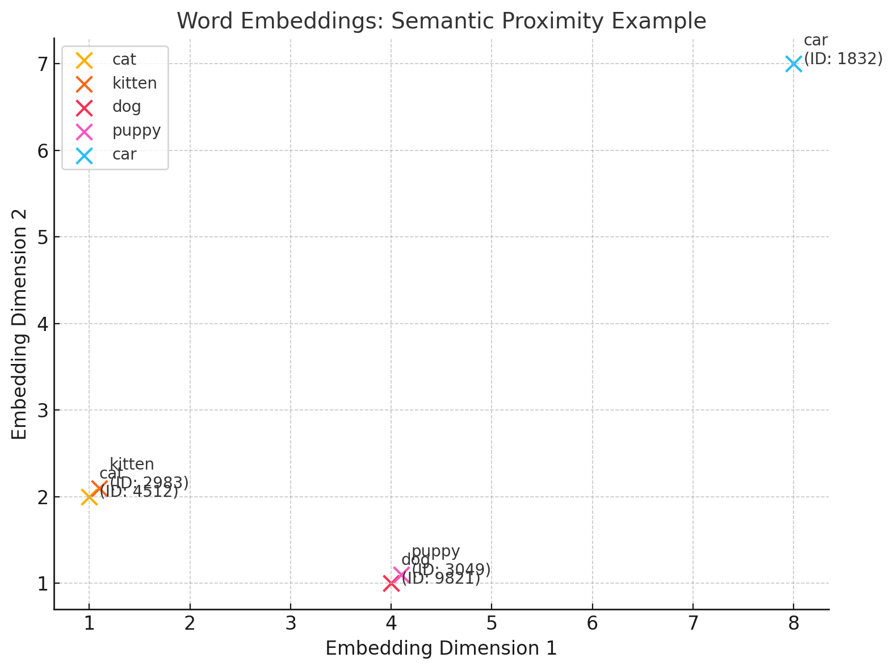
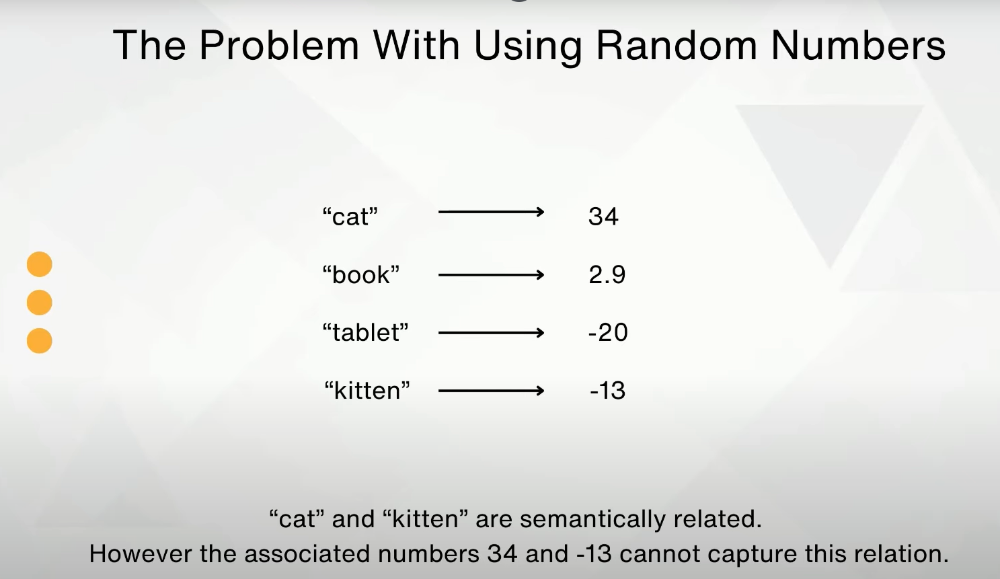
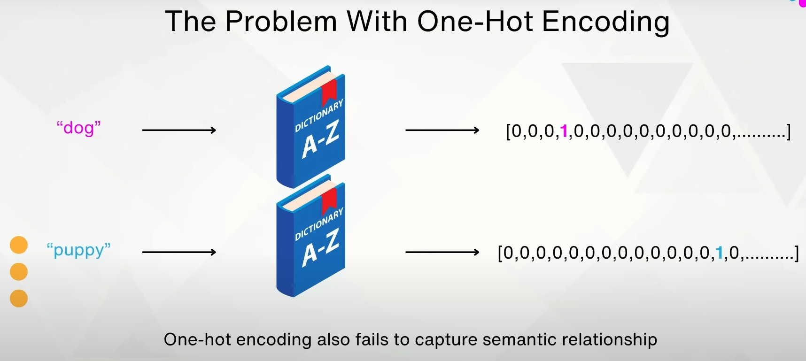
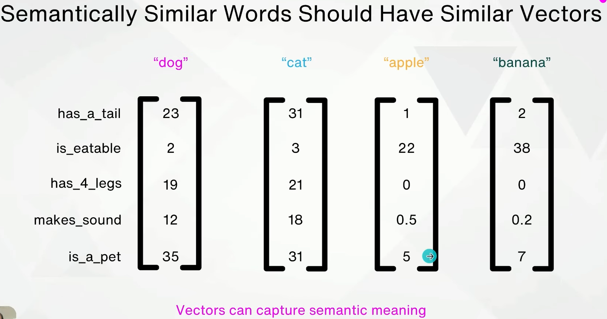
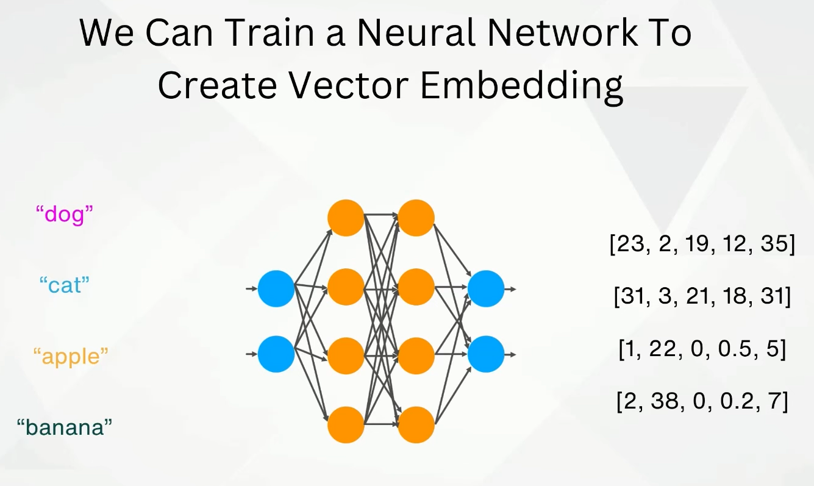
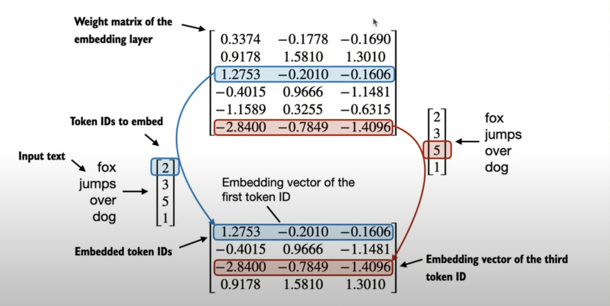

# **Token/Vector Embeddings**



So in this lecture we're going to dive into step 3, creating `token embedding` or what some people call it `vectore embeddings`... _the previous steps(1 & 2) you'll find them in the lecture 7, 8 and 9._

- [💎 lecture 7 💎](lecture_7.ipynb)
- [💎 lecture 8 notebook 💎](lecture_8.ipynb) / [💎 lecture 8 note 💎](lecture_8_notes.md)
- [💎 lecture 9 notebook 💎](lecture_9.ipynb) / [💎 lecture 9 note 💎](lecture_9_notes.md)

this note is going to be in 6 modules

## **Conceptual understanding of why tokens embeddings are needed?**

slides images



---

## 📌 Why Do We Need Token or Vector Embeddings?

### 🔧 Step 1: Why Do We Convert Words to Numbers?

- Computers can’t process raw text — they need everything as **numbers**.
- So we **tokenize** the text: convert each word or subword into a unique integer ID.
- This gives us a **vocabulary of token IDs** — just identifiers, like labels.

> 🔹 Example: `"cat"` → token ID `4512`, `"dog"` → token ID `9821`
> But these numbers are **arbitrary** — they carry **no semantic meaning**.

---

### ❗ Problem: Token IDs Are Just IDs

- Token IDs are just **look-up indices**, not meaningful in terms of language.
- The model can't infer that:

  - `cat` is similar to `kitten`
  - `dog` is close in meaning to `puppy`

- **Just giving numbers like `4512` and `9821` doesn’t let the model reason about meaning**.

---

### ✅ Solution: Token Embeddings (aka Vector Embeddings)

- We **map each token ID to a vector** — a list of real numbers (like 128D, 512D, 768D, etc.).
- These vectors are **learned during training** and **capture relationships between words**.

> 🔹 After training:
>
> - Vector for `"cat"` will be **close** to `"kitten"` in embedding space.
> - Vector for `"king"` minus `"man"` plus `"woman"` ≈ `"queen"` (classic example)

---

### 🧠 Core Intuition:

> Token IDs = **names/labels**
> Token Embeddings = **meaning**

The **embedding layer** in a model transforms token IDs into dense vectors so the model can operate on meaning, not just position.

---

### 📌 Visual Analogy:

| Word     | Token ID | Embedding Vector (simplified) |
| -------- | -------- | ----------------------------- |
| "cat"    | 4512     | `[0.23, -0.11, 0.97, ...]`    |
| "kitten" | 2983     | `[0.25, -0.09, 1.02, ...]`    |
| "car"    | 1832     | `[0.88, 0.14, -0.65, ...]`    |

🔹 "cat" and "kitten" are **close in vector space**, even though their token IDs are random and unrelated.

---

### 🏁 Summary:

- **Token IDs** = symbolic labels → fast, unique, but meaningless alone
- **Embeddings** = learned vectors → represent **semantic relationships**
- This is why we don’t just feed token IDs directly into a neural network — the network first **embeds** them into vectors that make language **computable**.
  

```python
# Code for the image above
import matplotlib.pyplot as plt
import numpy as np

# Sample words and token IDs
words = ["cat", "kitten", "dog", "puppy", "car"]
  token_ids = [4512, 2983, 9821, 3049, 1832]

# Create mock embedding vectors in 2D for visualization
embedding_vectors = {
    "cat": np.array([1.0, 2.0]),
    "kitten": np.array([1.1, 2.1]),
    "dog": np.array([4.0, 1.0]),
    "puppy": np.array([4.1, 1.1]),
    "car": np.array([8.0, 7.0])
}

# Plot the embeddings
fig, ax = plt.subplots(figsize=(8, 6))
for word, vec in embedding_vectors.items():
    ax.scatter(vec[0], vec[1], label=word, s=100)
    ax.text(vec[0] + 0.1, vec[1], f"{word}\n(ID: {token_ids[words.index(word)]})", fontsize=10)

ax.set_title("Word Embeddings: Semantic Proximity Example", fontsize=14)
ax.set_xlabel("Embedding Dimension 1")
ax.set_ylabel("Embedding Dimension 2")
ax.grid(True)
ax.legend(loc='upper left')
plt.tight_layout()
plt.show()
```

---





## 🧠 Why Use Vector Embeddings Instead of Token IDs or One-Hot Vectors?

### 🟦 1. What Token IDs Give Us

- Token IDs are just **unique integers** (e.g., `"dog"` → `23`, `"cat"` → `17`)
- They are **arbitrary** and **carry no meaning**
- The model has **no way of knowing** that `dog` and `cat` are related

📉 **Problem**: Token IDs don’t encode similarity — `23` and `17` are just numbers, not relationships.

---

### 🔲 2. What One-Hot Vectors Give Us

- A one-hot vector represents a token as a high-dimensional binary vector
- Example for a 10-word vocab:
  `"dog"` → `[0, 0, 0, 1, 0, 0, 0, 0, 0, 0]`

📉 **Problem**: All vectors are **equidistant**, no concept of similarity
→ `"dog"` is just as far from `"cat"` as it is from `"banana"`

---

### ✅ 3. What Vector Embeddings Give Us (as shown in your image)

Instead of using fixed numbers, we let the model **learn a dense vector** (e.g., 100–768 dimensions) for each token.

---

#### 📊 In the Image Above:

Each word (e.g., `"dog"`, `"cat"`, `"apple"`, `"banana"`) is represented as a **vector of features**, such as:

| Feature     | dog | cat | apple | banana |
| ----------- | --- | --- | ----- | ------ |
| has_a_tail  | 23  | 31  | 1     | 2      |
| is_eatable  | 2   | 3   | 22    | 38     |
| has_4_legs  | 19  | 21  | 0     | 0      |
| makes_sound | 12  | 18  | 0.5   | 0.2    |
| is_a_pet    | 35  | 31  | 5     | 7      |

🔹 `"dog"` and `"cat"` have **similar vectors** — close in semantic space <br>
🔹 `"apple"` and `"banana"` are also close, but very different from `"dog"` or `"cat"`

---

### 🎯 The Key Takeaway

| Representation Type | Captures Similarity? | Learns Semantics? | Useful for NN? |
| ------------------- | -------------------- | ----------------- | -------------- |
| Token IDs           | ❌ No                | ❌ No             | ❌ Weak        |
| One-hot vectors     | ❌ No                | ❌ No             | ⚠️ Sparse      |
| Vector embeddings   | ✅ Yes               | ✅ Yes            | ✅ Optimal     |

---

### 🧠 Bonus Analogy:

> Token IDs = names on a list <br>
> One-hot = attendance sheet (yes/no) <br>
> Embeddings = personality profile (multi-dimensional, descriptive)

---

### **NOW ALL THIS IS GREAT, NOW HOW DO WE MAKE IT SO THAT `DOG/PUPPY`, `CAT/KITTEN`... ARE IN THE SAME AREA IN THE VECTOR SPACE... LET DIVE INTO THAT**

- So we train a neural network for this task
  
- Representing words as vectors, so that the semantic relationship is captured is what we call as `vector` or `token` embeddings

## **Small hands on demo: Playing with token embeddings**

- [💎 link to vector embedding demo in colab notebook 💎](https://colab.research.google.com/drive/1_ceJDQUHBasbaTB74vg2Fz2N_O2h6C3T?usp=sharing)
- [💎 Local version of notebook 💎](notebooks/Vector_embedding_demo.ipynb)
  - use this python command `!pip install gensim==4.3.3 numpy==1.26.4 scipy==1.13.1 --force-reinstall` _running the default code gave me an error but this command worked for me._
- [💎 link to hugging face🤗 google's 100 billion `word2vec-google-news-300` vector embedding model in `300 dimensional space` 💎](https://huggingface.co/fse/word2vec-google-news-300)

## **🧩 How Are Token Embeddings Created in LLMs?**


### 📌 What the Diagram Shows

This is the **embedding matrix** used in LLMs like GPT-2:

- **Vocabulary Size** (rows): 50,257 unique tokens (words, subwords, punctuation, etc.)
- **Vector Dimension** (columns): 768-dimensional vectors (each token maps to one)

📐 Shape of the embedding matrix:
**`[50257, 768]`**

**Each row:** vector representation for one token <br>
**Each column:** one latent feature the model can learn (e.g., syntactic role, semantic nuance, etc.)

---

### 🔢 **Step-by-Step:** How Are These Embeddings Learned?

1. **📥 Initialization**

   - At the very beginning, embeddings are **random numbers**
   - This gives the model a place to start learning from

2. **🔁 Training**

   - During training (on text prediction), these embeddings are **updated** via backpropagation
   - When the model makes a prediction error, the gradients update the embedding weights to reduce future errors

3. **🧠 Learning Meaning**

   - Over time, similar tokens get **similar vectors** because they occur in similar contexts
   - For example, `cat`, `kitten`, `dog`, `puppy` will end up clustered close together

4. **📚 Final Embedding Table**

   - After training, the embedding table **encodes semantic and syntactic structure of the language**

     > In language, `syntactic structure refers to the grammatical rules that govern how words and phrases are arranged to form sentences, while semantic structure focuses on the meaning of those words and sentences`. Syntax ensures sentences are grammatically correct, whereas semantics concerns the interpretation of meaning. <br>

     > **Syntactic Structure (Syntax):** <br>
     > This aspect of language deals with the rules of sentence construction, including word order, agreement between words, and the use of various grammatical components like noun phrases, verb phrases, etc. For example, in English, a basic sentence structure is Subject-Verb-Object (SVO). While a sentence might be syntactically correct, it could still be meaningless from a semantic standpoint. <br>

     > **Semantic Structure (Semantics):**<br>
     > This aspect focuses on the meaning of words and sentences, including how words relate to each other and how sentences convey meaning. It involves understanding the relationships between words, phrases, and the overall message. For instance, "The cat sat on the mat" has a clear semantic meaning because the words and their arrangement convey a specific action and relationship.<br>

     > **Relationship between Syntax and Semantics:** <br>
     > While they are distinct, syntax and semantics are interconnected. A sentence needs to be syntactically correct to be understood semantically, but a syntactically correct sentence may not always be semantically meaningful. Semantics is also influenced by contextual cues, such as the surrounding words or the situation in which the sentence is used, [according to Study.com](https://study.com/academy/lesson/using-syntactic-semantic-context-clues-to-determine-meaning.html).

   - The model can now use these vectors to _"understand"_ and _predict_ tokens more effectively
     > **The `embedding layer` is a lookup operation that retrieves rows from a the embedding later weight using a token ID** >  > **NB: this `embedding layer` is also the same as `neural network linear layer` but the embedi dng layer is used because it is computationally efficient and it scales up when building these large language models, since `torch.nn linear layers` has many uncessary multiplication with zero**

---

### ✅ Why This Matters for LLMs

| Thing              | Token ID | One-Hot Vector | Embedding Vector |
| ------------------ | -------- | -------------- | ---------------- |
| Meaningful?        | ❌ No    | ❌ No          | ✅ Yes           |
| Trainable?         | ❌ No    | ❌ No          | ✅ Yes           |
| Fixed Length?      | ✅ Yes   | ✅ Yes         | ✅ Yes           |
| Used in LLM input? | ❌ No    | ❌ No          | ✅ Yes           |

---

### 🧠 Deeper Insights

- 🔍 **Each embedding is like a learned feature detector** — some dimensions may correlate with sentiment, topic, formality, etc.
- ⚙️ These embeddings are used **not just once**, but again after each transformer block via **residual connections**
- 🧬 You can think of embeddings as a **compressed prior** — a soft summary of the model’s experience with a word
