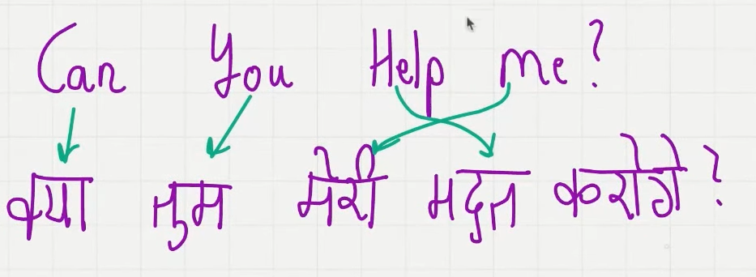
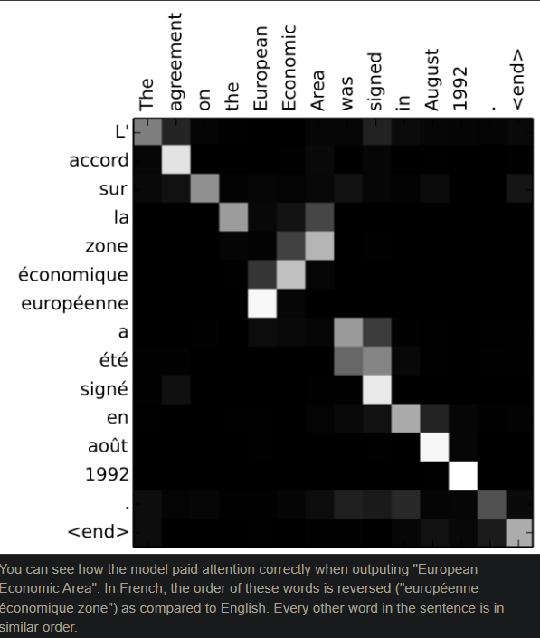
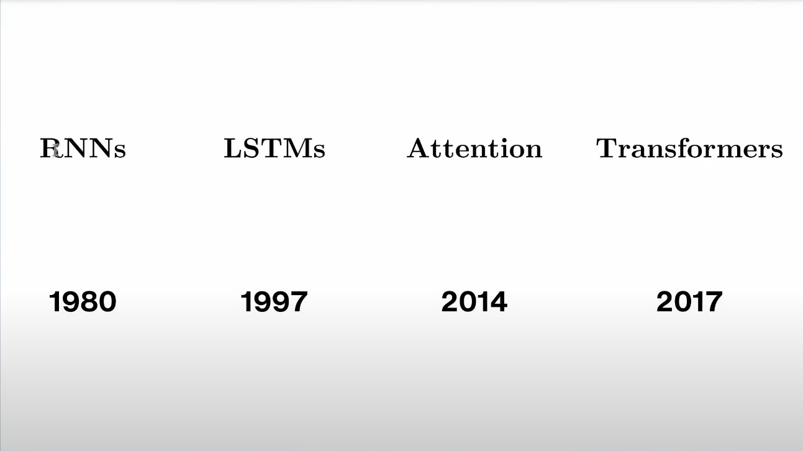
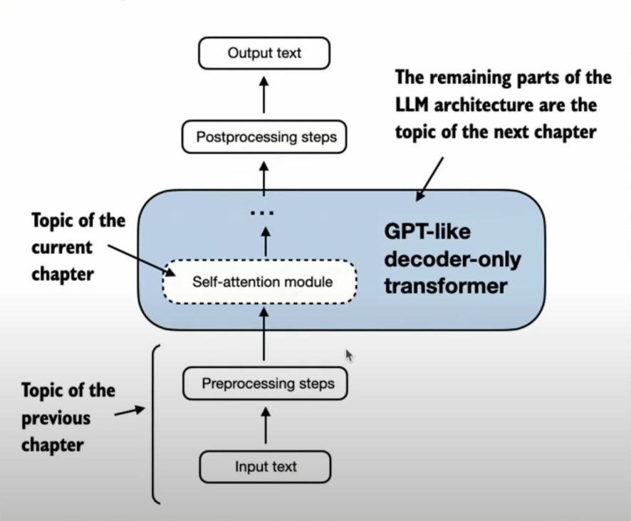

# 🔍 **Attention Mechanism – Introduction**

### 📚 Resources

- [Visual Guide & Animation](https://jalammar.github.io/visualizing-neural-machine-translation-mechanics-of-seq2seq-models-with-attention/)
- [Paper: _Attention Is All You Need_ (1706.03762)](https://arxiv.org/abs/1706.03762)

---

## 🧠 The 4 Types of Attention Mechanisms

- **Simplified Self-Attention**
- **Self-Attention**
- **Causal Attention**
- **Multi-Head Attention** (used in GPT)

---

### 🧪 Simplified Self-Attention

- A minimal, clean form of self-attention – useful for intuition building.

### 🧪 Self-Attention

- Adds **trainable weights**, forming the core of attention in LLMs.

### 🧪 Causal Attention

- A variant of self-attention that **restricts future context**, only attending to previous and current tokens.

### 🧪 Multi-Head Attention

- Allows the model to focus on **different parts of the sequence in parallel**, across various representation subspaces.

---

## ❗️ The Problem with Modeling Long Sequences

Before attention, sequence modeling (like translation) was handled using **RNN-based encoder-decoder** architectures:

> **Word-by-word translation fails.** >  > 

Translation requires **contextual understanding** and **grammar alignment**.

To address this:

- Use **Encoder** to process input
- Use **Decoder** to generate output
  
  📹 _[watch video](images/L13_enc_dec1.mp4)_

Under the hood:

- Encoder processes the full input into a **context vector**
- Decoder generates output **step-by-step**, using that context

---

## 🧱 Encoder-Decoder with RNNs

### Key Process:

- Each token updates the hidden state
- Final hidden state (a summary) passed to decoder
- Decoder generates one word at a time

### 💡 Your Insight:

> “The decoder loses full context—it only sees a compressed summary from the encoder. Imagine writing an exam from just a 1-pager summary of a 6-month course... Too much gets lost!”

---

## 😣 Limitations of RNNs

- Decoder **only sees the last hidden state**
- No access to earlier steps of the input
- Context loss grows with sequence length

Example:

> “The cat that was sitting on the mat, which was next to the dog, jumped.”
> The word “jumped” depends on understanding that “cat” is the subject—many steps back in the sentence.
> An RNN struggles with this **long-range dependency**.

---

## 🎯 Solution: Attention Mechanism

- In 2014, Bahdanau et al. proposed **soft attention** in RNNs
  ([paper](https://arxiv.org/abs/1409.0473))

### Key Idea:

- Decoder dynamically focuses on **different parts of input** at each step
- Uses **attention weights** to decide **which input tokens matter most**

---

## ⚡️ Transformer Breakthrough (2017)

- Researchers found **RNNs aren't necessary**
- Introduced the **Transformer architecture** using **self-attention**

> Reusing our earlier sentence:
> “The cat... jumped.”

At each decoding step, the model can:

- **Look back at the full input**
- **Decide what matters most** (e.g., when generating "saute", attend to "jumped")

This **dynamic focusing** allows for learning **long-range dependencies**.

> 💬 “The model isn’t blindly aligning word 1 to word 1—it learns the proper alignment during training.”

---

## 🧾 A Brief History of Attention

> 🔎 “Everyone talks about transformers now, but this line of research has evolved over **43+ years**.”

---

## 💥 Self-Attention = Core of LLMs

- **Self-Attention** allows each token to **attend to all other tokens** in the sequence.
- Core to Transformer-based models like GPT.

---

## 🌀 Self-Attention: How It Works

- In **self-attention**, the model learns **relationships between words in the same input sequence**.
- Different from earlier **attention** which dealt with **two separate sequences** (encoder + decoder).
