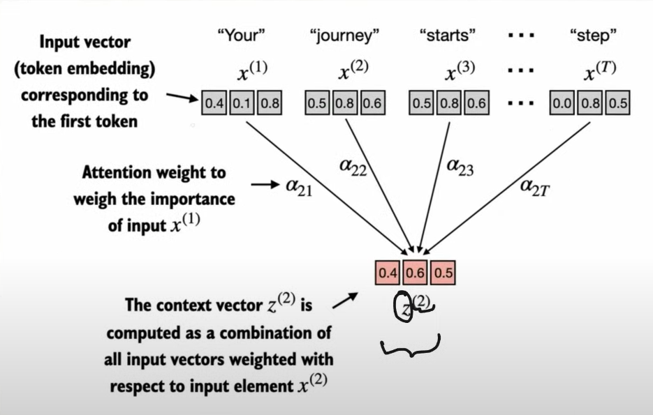
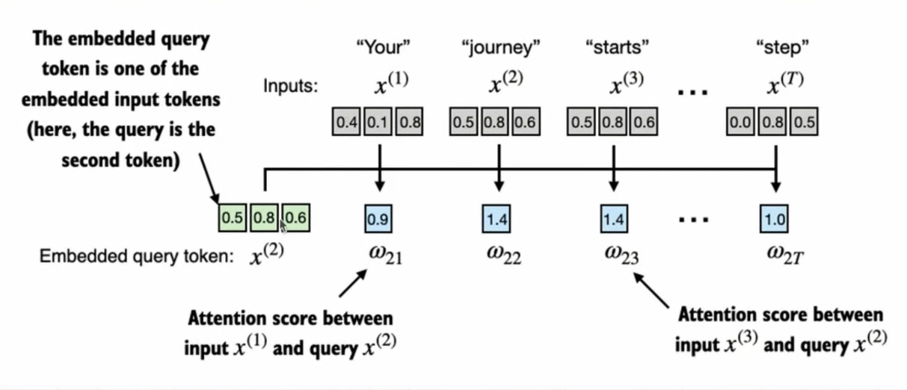
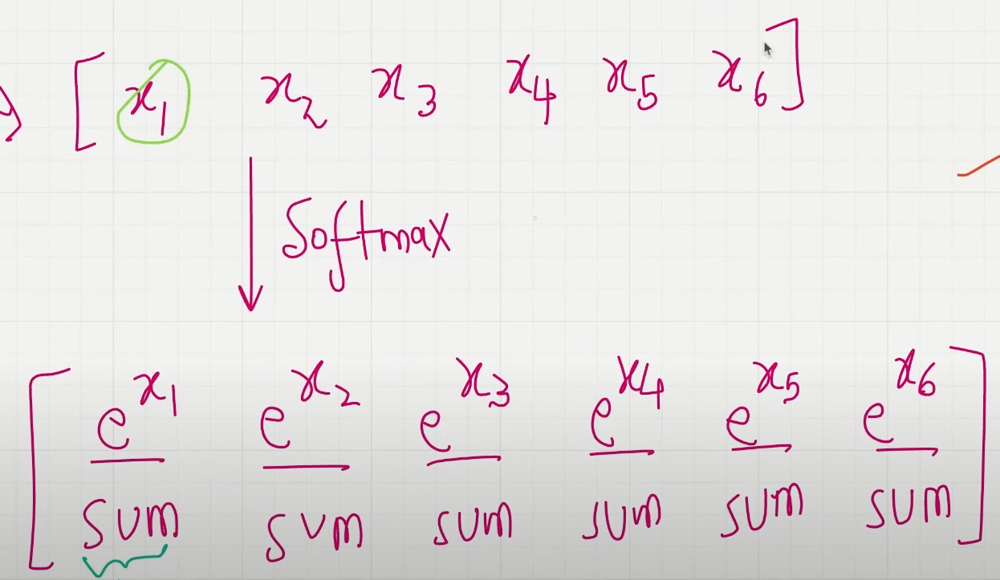
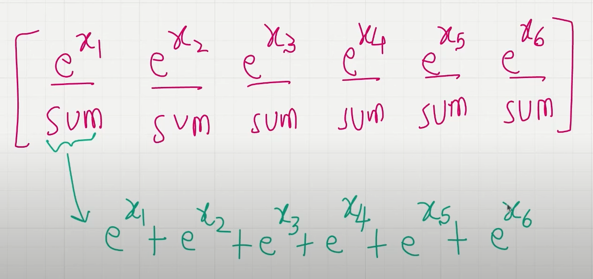
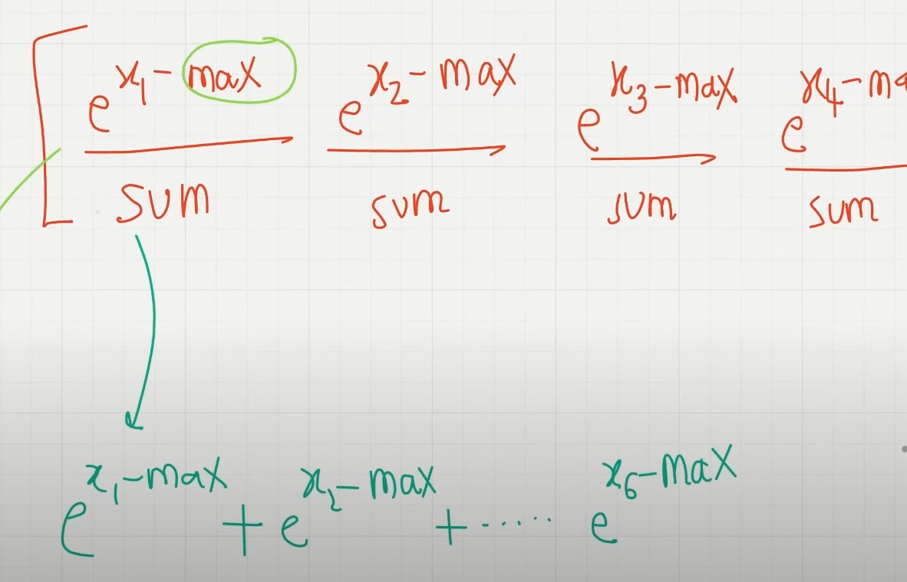
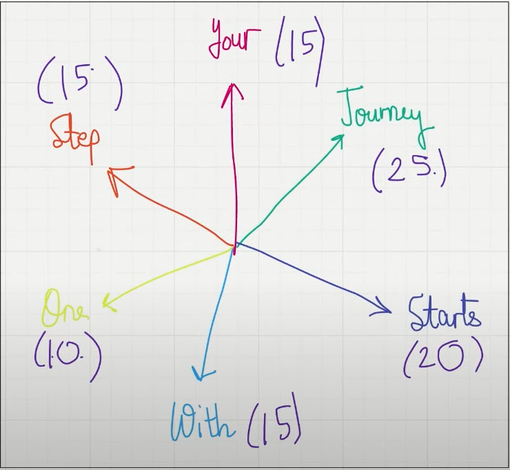
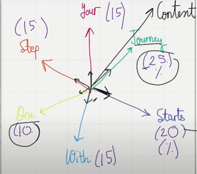
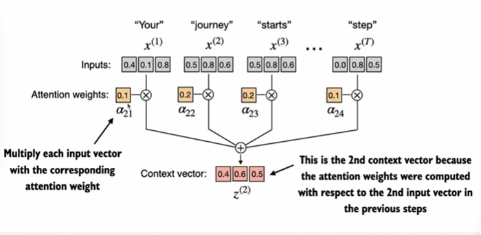

# A simplied self attention mechanism without trainable weights

- The goal for attention is pick the `vector + positions embeddings` which captures the semantic meaning and others... and `outputs a context vector`
- the `context vector` can be considered as an enriched embedding vector because it not all contains the semantic meaning but also contains information on how each word/token in the input sequence/sentence relate to each other. and this context helps model make the right prediction
  

## The goal of self attention

input, x: "your journey starts with one step"

- "Calculate a context vector `z(i)` for each element in `x(i)`"

  - Context vector: enriched embedding vector

- we find the context vector for each embedding element.

  - so we focus on `x(2)-query` for now with is coresponding context vector `z(2)`.
  - `z(2)` is an embedding which contains information about x(2) and all other input element `x(1)` to `x(T)`

- in this lecture we do not add the trainable weights. the trainable weights help the LLM learn to construct these context vectors, so that they relevant for the LLM to generate the next token

so our task to it convert the embeddings vector of a `query` into a context vector

1. First step of implementing self-attention is to compute the intermediate values `w`, also referred to as `attention scores`
   

2. The intermediate `attention scores` are calculated between the `query token`(dot product between query and everyth other input token) an each `input token` us the `dot product`.

   - dot products quantifies how much two vectors are aligned
   - In the context of self attention mechanisms, **dot products determines the extent to which elements of a sequence attend to one another**, the higher the dot product, the higher the `similarity` and `attention score`

3. normalize attention scores

   - in normalization we can use the sum of all the attention scores and then divide each score by the total. this works perfectly fine, but the issue arrizes when there are extreme values eg: having say `1, 3, 4, 400` when using the sum and divide approach with this that we realise that the small values even though they are closer to zero then when doing backprogation, the model might tend to give some attention to the smaller values event though they're closer to 0.
   - so we use the softmax instead deals with this issues such that extreme values are much more very very close to 1 and the model considers those ones and the smaller values are almost negligible.
   - so we can use the softmax formula from the image below. which is the naive softmax formula.
     
     
   - but then is is for recommended to use pytorch softmax. which what subtracts the max number before performin the euler calculation. this looks quite similar to the naive formula, but the reason for `e^x_i - max` is to deal with numberical instability when dealing with very large values very low values computations which offen leads to overflow or underflow error(this is computation problem)
     

4. Computin gthe context vector
   - after computing the normalized attention weights, we calculate the contect vector z(z) by multiplying the embedding input tokens x(i), with the coreesponding attention weights and then summing the resultant vectors
   - after computing the normalized attention, **we multiply each of the input embedding vector by the corresponding attention weight to scale them down, then take the vector sum or them and that gives the context vector**
     
     
     

- attention weight matrix
  NB: apart from meaning, it is also important to capture, you also need to capture the informatio nof the context and without trainable weights we'll not be able to capture context correctly
