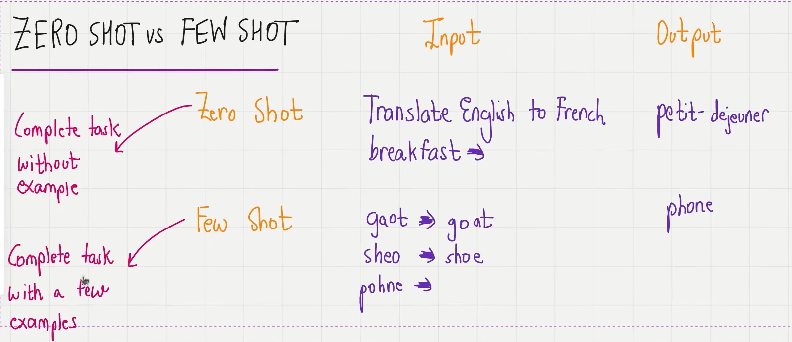
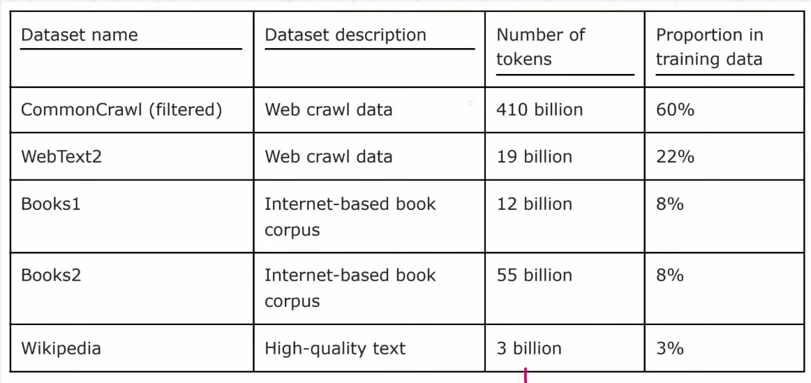
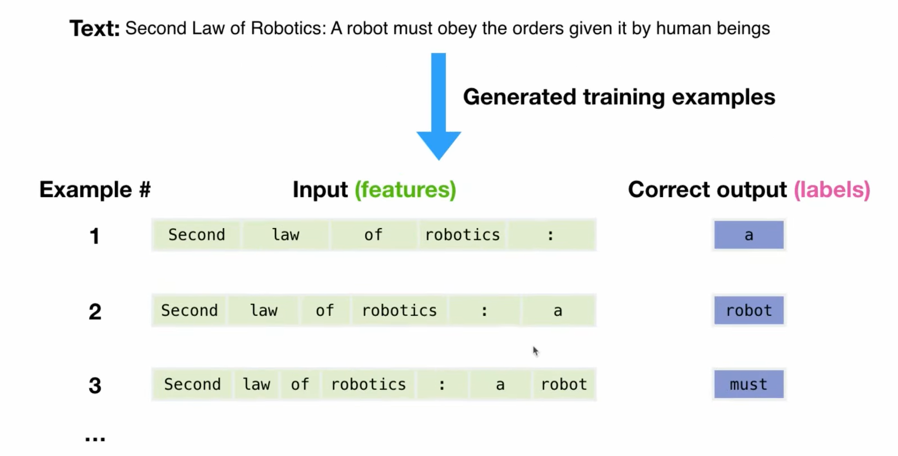
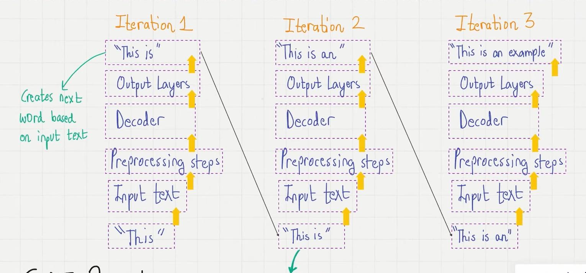
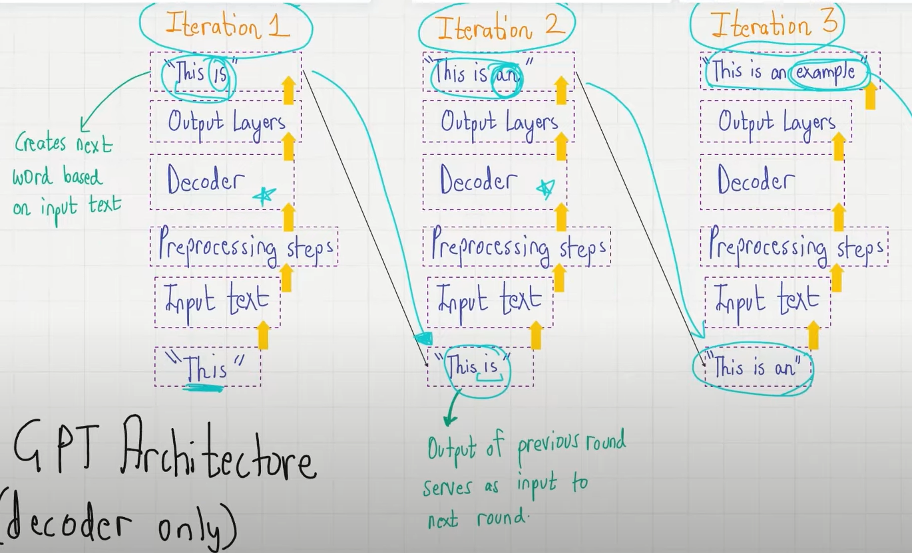

# A closer look at GPT

### 1. ZERO SHOT vs FEW SHOT LEARNING

- **Zero shot**: Ability to generalize to completely unseen task without any prior specific examples. Model has not support.
- **Few shot**: learning from a minimum number of examples which the user provides as input. Model sees a few examples of the task.
- egs of zero and few shot learning
  

### 2. UTILIZING LARGE DATASET

- GPT-3 dataset training
  
- **A token is a unit of text which the model reads.**
- the total pre-training cost for GPT-3 ~4.6 million dollars

- These pretrained models are base/foundational models which can be sued for further finetuning
- Many pretrained LLMs are available as opensource models. They can be used as general purpose tools to write, extract and edit text which was not part the training data

### 3. GPT Architecture

- GPT models are simpl trained on `next-word` prediction tasks.
  - eg: The lion roams in the `jungle`(next word)
- with this training, they can do a wide range of other task like translation, spelling correction etc!
  
- Next word prediction: Self-supervised learning -> self labeling
- we don't collect labels for the training data, but use the structure of the data itself, thus, **next word in the sentence is used as the label**. that is why these model are called `auto regressive models`

  - **Auto regressive model use previous outputs as inputs for future predictions.**
  - so 2 things make GPT models auto regressive

    1. next words in the sentence are used as the labels.
    2. use previous outputs as input for future predictions.

    > **Tip:** Pretaining of GPT models are `unsupervised` and `auto regressive`

- compared to the original transformer architecture, GPT architecture is simpler
- In GPT architecture, there is `no encoder`. we just have `the decoder`
- Original transformer had `6 encoder-decoder` blocks while `GPT-3 had 96 transformer layers` with `175 billion parameters`
  
  
- Although trained only for next word predictions, GPT model can perform other tasks like language translations. this is call `emergent behavior`
  - **emergent behavior is the ability of a model to perform task that the model wasn't explicitly trained to perform**
