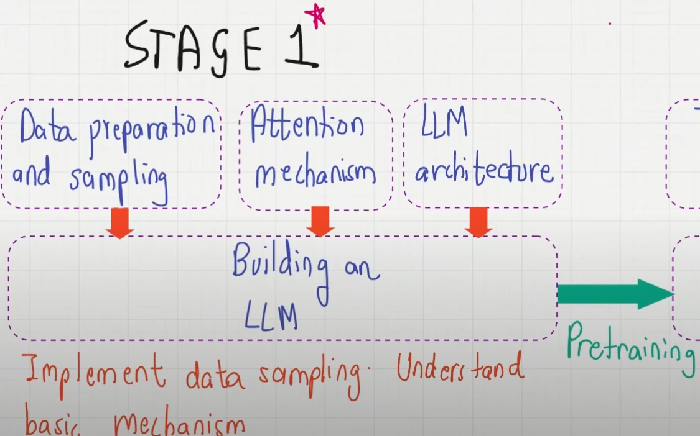
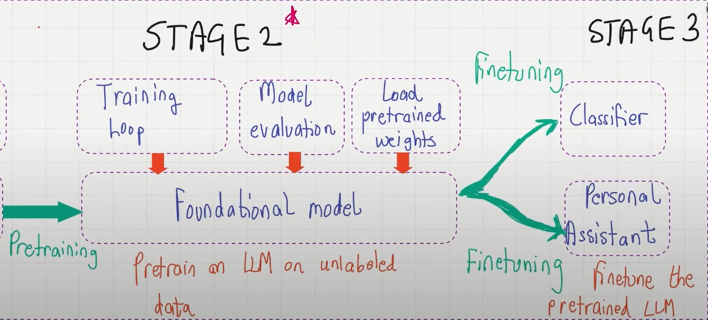
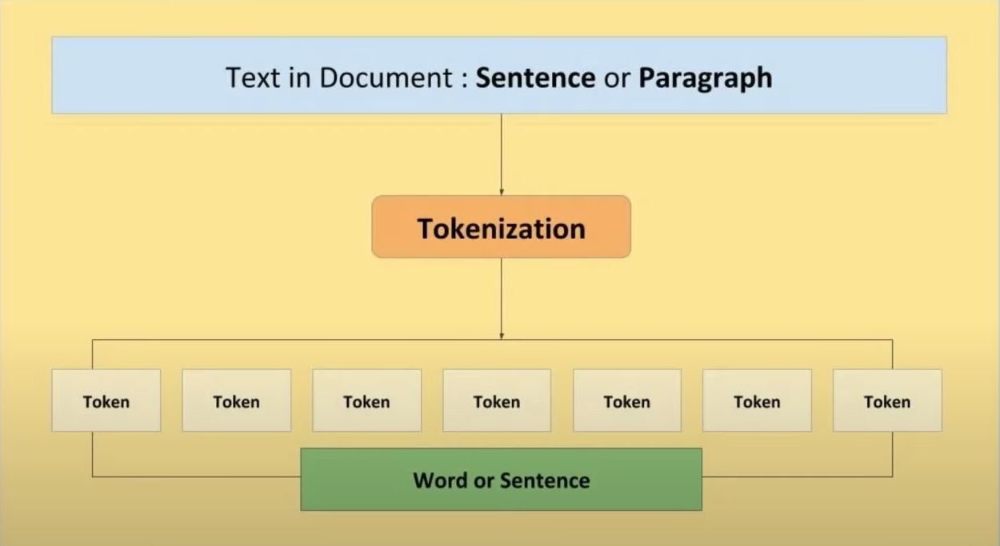
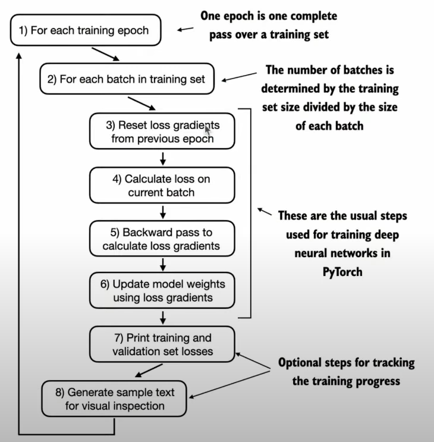
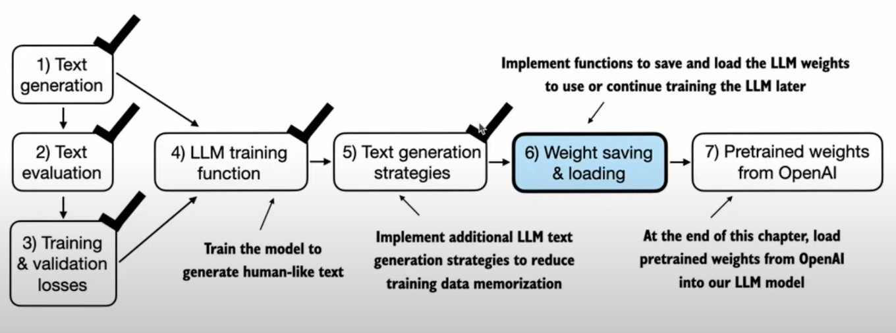
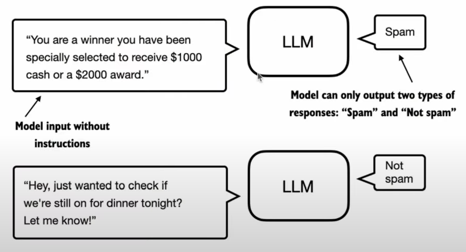
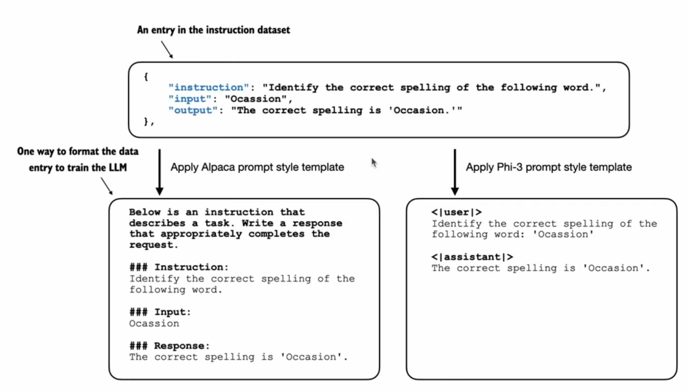

# Stages of building LLM

## Stage 1

### Data preparation and sampling

- here we'll look at `tokenization`, given a sentence, how to break them down into individual `tokens`
  
- after `tokenization`, we'll look at `vector embeddings`, converting words into high dimensional vector space. so capture semantic meaning of each words in the sentence. and go into `positional encoding`
  
- after we'll look at how to `construct batches of the data`, with huge amount of dataset, how to convert them into batchs to the LLM which we'll build, `look at next word prediction task`.
- implement data batching sequence

### Attention mechanism

### LLM Architecture

## Stage 2 - Pretraining

### Training loop

### Model Evaluation + Load pretrained weight

## Stage 3 - Finetuning

### Classifier

### Personal assistant

#### recap of all we've learnt so far

1. LLMs have transformed the field of NLP. They have led to the advancement in generating, understanding and translating human language.
2. Modern LLMs are trained in 2 main steps
   - `Pretraining` on unlabeled data(foundational model), very large dataset needed, typically billions of words
   - `Finetuning` on a smaller, labeled dataset. Finetuned LLMs can outperform just pretrained LLMs only on specific tasks
3. LLMs are based on the `transformer architecture`
   - **Key idea is the `attention mechanism` that gives LLMs selective access to whole input sequence when generating output one word at a time**
4. Original transformer had both `Encoder` + `Decoder`
5. GPT uses only `Decoder`, no `Encoder`
6. While LLMs are only trained for predicting next word, they show `emergent properties`(ability to classify, translate and summerize texts)
