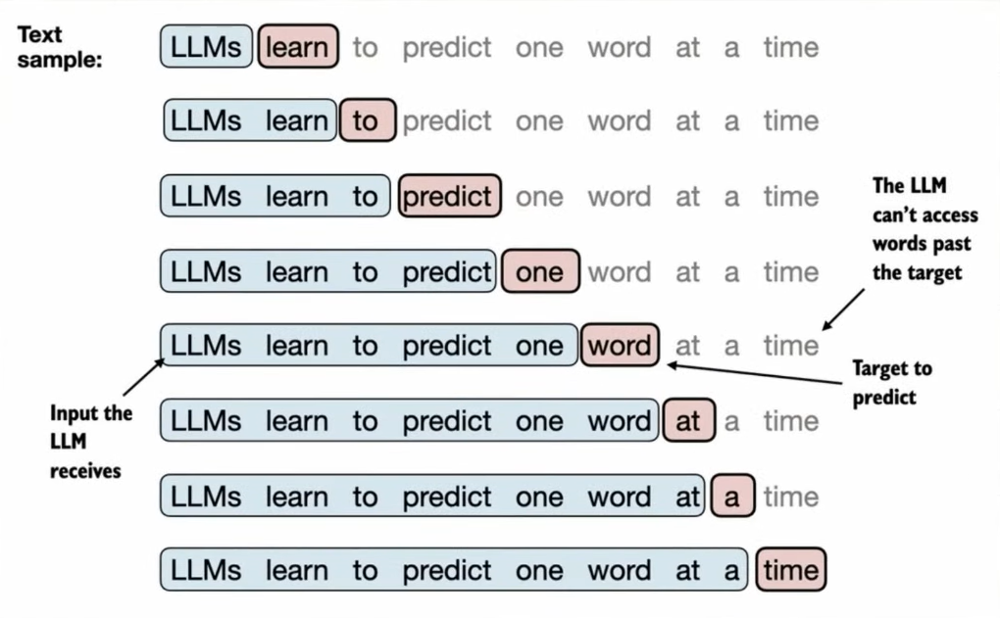
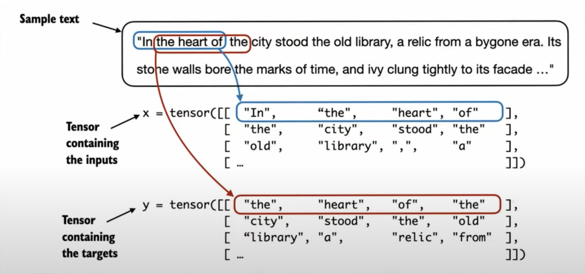
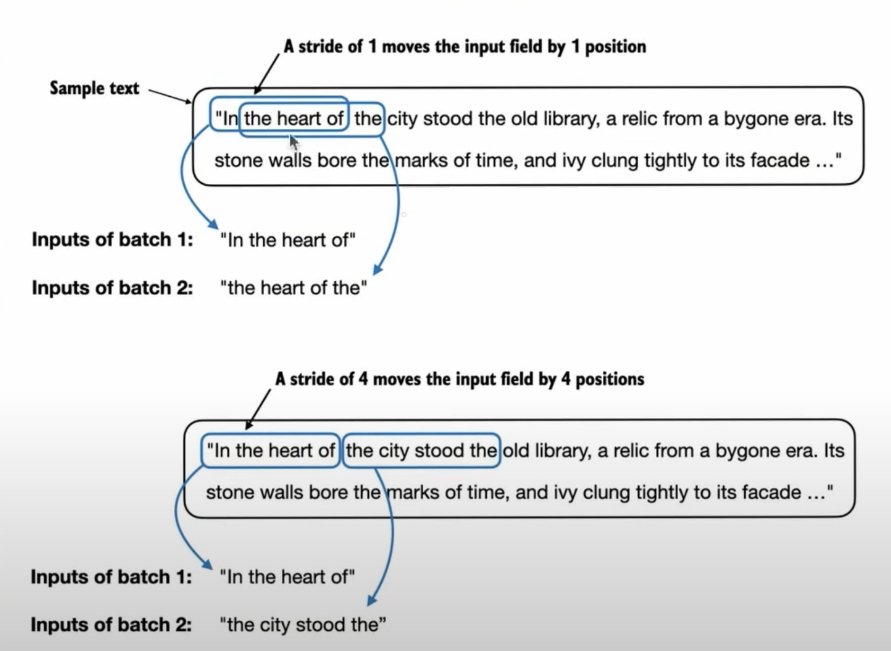

# **Creating Input-Target pairs**

**The last step before moving to creating vector embeddings is creating `input-target pairs`**

### **what do these input-target pairs look like?**

**Given a sample text**

- extract input blocks as subsamples that serve as input to the LLM
- The LLM prediction task during training is to predict the next word that follow the input block
- During training, we mask out all words that are past the target.

**Terminologies:**

- **Context size:** refers to how many words/tokens you want to give as input, for the model to make it's prediction
- The context size determines how many tokens are included in the input
- To think of it intuitively, **context size is basically how many words/tokens the model should pay attention at one time to predict the next word/token**
- The context_size of say `4` means that the model is trained to look at a sequence of `4` words (or tokens) to predict the next word in the sequence.

### **CREATING A DATA LOADER**

> We will implement a data loader that fetches input-output targe pairs using a sliding window approach
> 

- To implement efficient dataloaders, we collect `inputs` in a `tensor x`, where each row `represents one input context`. The second `tensor y` contains `the corresponding prediction targets(next word)`, which are created by shifting the input by one position
- **so basically, each input-output pair, correspond to `4(the context size)` task**

#### **MEANING OF STRIDE**

